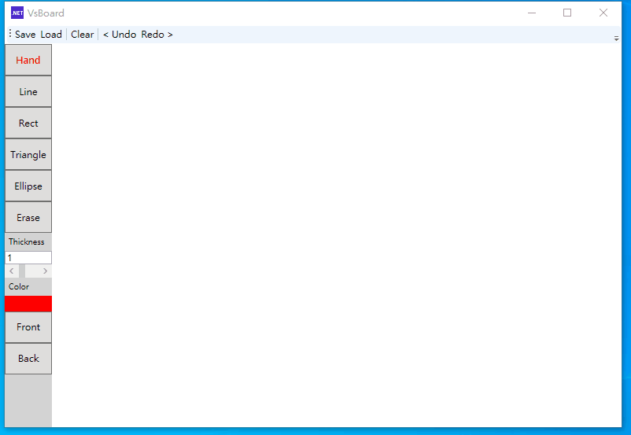
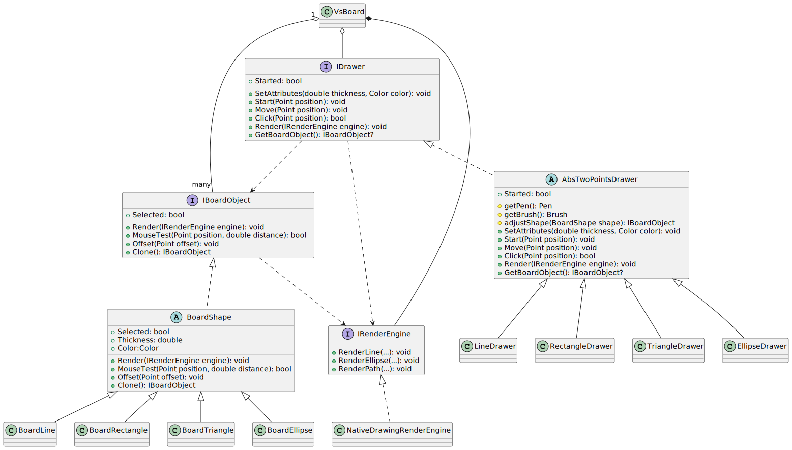

# VsBoard
VsBoard is a painting application like mspaint. The user can draw different shapes, select shapes, move shapes, and modify the attributes of the selected shape. Please refer to the following sections for more information.

## Features
- Utilize the "Hand" tool to select and move shapes.
- Draw lines, rectangles, triangles, and ellipses with the option to have either an outline or a filled interior (filled when thickness = 0).
- Modify the attributes of shapes such as thickness and color.
- Adjust the z-index of shapes to manage their order on the canvas.
- Use keyboard shortcuts Ctrl+C and Ctrl+V for copying-pasting of shapes.
- Undo and redo functionalities. (Modifying attributes is not supported yet due to limited time)
- Save and load the board(canvas) to/from local storage.

## Screenshots
**Showing the drawing capabilities and drawing a creature.**

<image src="assets/screenshot1.png" width="400" />
<image src="assets/screenshot2.png" width="400" />

**A short video (gif) to demonstrate all features of the application.**

## Dependencies
- `.Net 6 Runtime` for running and `.Net 6 SDK` for development.
- `Newtonsoft.Json` for saving and loading features.
- `xUnit` and `coverlet.collector` for unit test and coverage analysis.

## Design
### Class Diagram

### IBoardObject
I use the interface `IBoardOjbect` to represent shapes/objects that can be drawn on the board. The interface defines the essential APIs to support basic functions, such as rendering, moving, and mouse selecting. The abstract class `BoardShape` provides common members to reduce duplicated code. The other classes, such as BoardLine, inherent `BoardShape` and implement essential functions for each shapes. 

### IDrawer
I use the interface `IDrawer` to abstract the mouse drawing behavior. Basically, the mouse hehavior are `MouseDown`, `MouseMove`, and `MouseUp`. They are mapped to `Start`, `Move`, and `Click`. There are some other functions in the interface for rendering the current unfinished shape, changing the drawing attributes, and outputing the drawn shape. With this interface, VsWpf can simplify the mouse behavior and make it easier to support other shapes.

Because drawing from two points are common, I use `AbsTwoPointsDrawer` to re-use the code. Make each drawer can focus on the different part. Basically only `Render` and `GetBoardObject` are needed to implement.

The class `HandTool` is to implement the functions of shape selection, moving, removing. In fact, it's possible to make it to be a `IDrawer`. I didn't do that because it may need to improve the design of `IDrawer`.

### IRenderEngine
The interface `IRenderEngine` is to abstract the 2D graphic. The consideration is that we may need to switch the backend of 2D graphic for performance or portability. Here I only select the minimum APIs and only build a `NativeDrawingRenderEngine` that use `Canvas` and `DrawingContext` to support the rendering.

### VsBoard
The class `VsBoard` coordinates `IBoardShape`, `IDrawer` and others to implement to the core features.

### Others
The class `MainWindow` is the entry point and provides GUI for tool selection, saving, loading and other operations. And the classes `BoardHistory` and `BoardHistoryItem` are used to keep history data and encapsulate history undo/redo logic.

## Unit Tests
I focus on testing `IBoardObject` to make sure the functions, such as shape rendering, mouse selecting, moving and cloning, working correctly. I select `xUnit` as the test framework and implement the test cases for `Offset`, `Clone`, `MouseTest` and some calculation functions. All tests are separated in the project `VsWpf.Test`.

## Copyright
Copyright © 2023 Yuan-Sheng Hsiao. All rights reserved.

No part of this project may be reproduced, distributed, or transmitted in any form or by any means, including photocopying, recording, or other electronic or mechanical methods, without the prior written permission of the copyright owner, except in the case of brief quotations embodied in critical reviews and certain other noncommercial uses permitted by copyright law.
